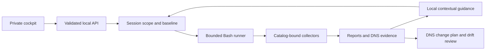

# Claudit architecture review and Codex handoff

Date: 2026-09-08 · Source branch: `main` · Runtime: 0.5.0 · Catalog: 2026.09.2

## Executive assessment

Claudit now has a working private assessment workflow: create a scoped work
session, save a known configuration, execute Formal/Passive/Active checks, retain
evidence, ask contextual questions, record decisions and repeat the assessment.
The architecture remains a Bash collector with a small standard-library Python
cockpit and plain JSON files. No new runtime packages, agents or hosted language
model were introduced.

This review corrected consequential execution and evidence-integrity defects.
Every assessment field in the shipped baseline is now executable; target and
authorization fields remain explicit scope boundaries. Treat the resulting
coverage as a private operator assessment contract, not a compliance
certification for every possible cloud service.

No remote cloud or DNS mutation is part of the product. Provider collection is
read-only and active probes are bounded to declared targets. Deterministic
fixtures cover secure, insecure, unavailable and malformed evidence paths.

## Architecture reviewed

| Surface | Responsibility | Assessment and resulting direction |
|---|---|---|
| `claudit.sh`, `lib/core.sh` | CLI, scope, baselines, report generation | Retain Bash; enforce Formal isolation, selected services, private output permissions and scope snapshots. |
| `lib/controls.sh`, runtime catalog | Finding identity, control metadata, coverage | Retain one binding catalog; missing planned controls emit `unknown`. Historical catalog is not the runtime contract. |
| `checks/domain.sh` | Public DNS and one HTTPS HEAD | Validate DNS response status/type; retain observations; compare declared RRsets; require authenticated data for a DNSSEC pass. |
| `checks/providers.sh`, `checks/inventory.sh` | Read-only provider checks and inventory | Preserve provider CLIs; distinguish malformed/unavailable data. One AWS region per run avoids silently ignoring requested regions. |
| `checks/m365.sh`, `checks/exchange.sh`, Exchange adapter | Graph and Exchange evidence | Scope emitted Graph findings to selected services; missing settings stay unknown. Exchange remains an optional isolated PowerShell dependency. |
| `checks/vps.sh` | Declared host validation and read-only posture | Require existing trusted host keys; assess exposed listeners, updates, firewall, authentication logging and effective SSH policy. |
| `lib/drift.sh` | Compare reports | A failure followed by unavailable evidence is not fixed. Reports with declared differing scopes are rejected. |
| `lib/interchange.sh`, `lib/notify.sh`, schemas | Portable projections and optional notifications | Canonical Claudit JSON remains authoritative. OCSF 1.8 events and OSCAL 1.2.3 output pass the official structural validators; this does not certify assessment content. Dashboard children do not inherit webhook delivery configuration. |
| `service/dashboard.py` | HTTP/API, execution, artifacts | Native HTML, authentication, request validation, bounded runner and confined artifact access. |
| `service/workspace.py` | Sessions, known configuration, guidance | New file-backed session model with fixed scope/baseline, evidence citations and persistent notes/questions. |
| `web/` | Operator workflow | Sessions, descriptive queries, DNS plans and provider-neutral zone export are available in one minimal workflow. |
| Installer/systemd | Single-host deployment | Retain existing installation model; document password requirement before upgrading a network-bound instance. |
| `legacy/powershell/` | Historical implementation | Retained as reference; no longer parsed at runtime to generate cockpit HTML. Not audited as a supported application. |

## Implemented corrections

### High priority: execution and access

1. **VPS shell injection removed.** A target was embedded directly into a
   `bash -c` expression. Host validation and positional argument passing now
   prevent it from becoming shell code. Regression tests use a command-shaped
   target and verify that no marker file is created.
2. **Formal isolation enforced centrally.** Supplying a connection flag to a
   Formal run previously allowed provider reads. Formal now clears connection
   authorization; VPS returns after scope validation. Tests replace every
   provider/network executable and verify zero invocations.
3. **Private network access enforced.** A non-loopback bind requires a password
   of at least 24 characters. When configured, every route requires HTTP Basic
   authentication, including reads. The HTML request token remains a separate
   mutation guard. Host validation, no-store responses, content security policy
   and sandboxed HTML reports reduce browser-origin exposure.
4. **Explicit operation authorization.** The dashboard no longer supplies
   read-only connection authorization silently. Session and direct launch paths
   require the supplied confirmation; Active needs its additional confirmation.
5. **Runner bounds and state integrity.** Two concurrent operations maximum;
   each process group has a 600-second limit. Mutating state operations are
   serialized. Lost process tracking becomes `Interrupted`, never successful.
   An exit without a report becomes `EvidenceMissing`.
6. **Log access confinement.** Operation identifiers are validated; log paths
   are derived from the operation directory rather than metadata-supplied paths.
   Artifact access remains confined to the report root and supported suffixes.

### High priority: findings must reflect evidence

7. **Incomplete reports cannot show Pass.** Empty or unknown-only reports are
   `Incomplete`; malformed finding data is `InvalidReport`.
8. **Coverage includes missing controls.** Selected catalog controls that emit
   no evidence become `unknown`. Runtime/dependency controls are excluded from
   automatic completion; coverage describes supported planned findings, not all
   desired policies or the whole cloud estate.
9. **DNS transport success is not DNS success.** SERVFAIL, REFUSED, malformed
   answers and truncation stay unavailable. Record-type filtering prevents a
   CNAME from satisfying an A/AAAA or other requested-record check. Duplicate
   DMARC records fail. DNSKEY presence alone cannot pass DNSSEC.
10. **Raw DNS evidence retained.** Normalized evidence hashes include DNS values
    and authentication state, excluding changing TTLs. Raw observations and
    desired/observed RRsets are separate artifacts. DNS findings may share
    accumulated observations, so one changed response can change multiple
    finding evidence hashes.
11. **Provider response handling tightened.** Azure/GCP list controls reject
    non-array responses. Failed GCP inventory cannot become a passing zero count.
    Missing SharePoint/OneDrive fields and unrecognized sharing enums remain
    unknown. Selecting one Graph service no longer emits unrelated service
    findings or queries unrelated Entra/drive endpoints.
12. **Drift does not invent remediation.** Only `fail → pass` becomes `Fixed`.
    A scope mismatch between modern reports is rejected. Legacy scope-less
    reports retain compatibility and require manual scope review.

### High priority: executable baseline boundary

13. **Baseline support is now explicit and fail-closed.**
    `config/baseline-capabilities.json` maps every shipped baseline key to
    `enforced` or `scope_only`. Enforced entries name their runtime controls;
    scope-only entries define the authorized assessment boundary. Startup, CLI execution and tests
    reject a malformed or incomplete map. Every report retains the exact map
    used for the run as `claudit-baseline-capabilities.json`.

14. **DNS resolver selection is explicit and reproducible.**
    `Domain.Resolver` names one HTTPS DoH endpoint, whether it is
    operator-declared private, and a bounded timeout. Passive collection uses
    that endpoint only; it never falls back to a public resolver. Each raw DNS
    observation retains resolver provenance and the provenance contributes to
    the finding evidence hash. URLs with credentials, query strings or
    fragments are rejected to keep secrets out of stored baselines and reports.

15. **AWS assessment now has bounded resource-level evidence.** The selected
    caller identity is validated and retained in a private run artifact. The
    collector evaluates root MFA, minimum password length, password maximum age,
    password reuse prevention, active IAM user access-key age, CloudTrail
    presence, multi-region and log-file-validation properties, plus public
    security-group ingress against the declared TCP allow-list. Every collected
    VPC must also have an active, successfully delivering Flow Log. IAM users,
    security groups, VPCs and Flow Logs are paginated with a ten-page bound;
    denied, malformed or incomplete collection remains `unknown` or `error`,
    never `pass`. User and access-key identifiers are not copied into findings.

16. **Azure assessment now has resource-level evidence.** The selected
    subscription and tenant identity are validated and retained in a private
    run artifact. The collector evaluates high-risk role assignments against
    approved object IDs, storage-account network default action and Key Vault
    purge protection. Activity Log evidence proves configured category coverage
    using enabled alerts scoped to that subscription with at least one action
    group; the baseline declares the required categories. Disabled, unscoped,
    unactionable or incomplete coverage fails. Denied and malformed responses
    remain `unknown` or `error`; no response is treated as evidence of a secure
    empty estate.

17. **GCP assessment now has resource-level evidence.** The selected project
    identity is retained in a private run artifact. The collector evaluates
    primitive IAM role members against the approved allow-list, required
    allServices audit-log types, the project OS Login metadata setting, and the
    presence of an enabled user-managed logging sink with an explicit
    destination. Enabled user-managed service-account key age is checked without
    copying account email or key identifiers into findings. The sink check does
    not certify destination retention. Secure, insecure, denied and malformed
    fixture responses preserve fail-closed findings.

18. **Interchange projections now validate structurally.** OSCAL output uses
    RFC 4122 version-5 UUIDs, declares its assessment-plan reference, identifies
    the reviewed controls and supplies the required result metadata. Results
    without a control determination (`unknown`, `error`, `not_applicable`) are
    retained as observations instead of being mislabeled `not-satisfied`.
    Validation on 8 September 2026 passed the official NIST OSCAL 1.2.3 JSON
    Schema and the official OCSF validation API for the emitted OCSF 1.8 events.

19. **Microsoft Graph collection follows bounded continuations.** Conditional
    Access policies now follow the complete opaque `@odata.nextLink` URL for up
    to ten pages. Continuations are restricted to the Microsoft Graph v1.0
    origin so the bearer token cannot be redirected. Malformed, unavailable or
    over-bound sequences remain `error` or `unknown`, with offline tests for
    aggregation, hostile continuation URLs and incomplete pagination.

20. **Finding identity includes resource scope.** Every finding now carries a
    one-way `resource_uid`, and its stable `finding_id` includes that scoped
    identity. The raw scope value is not duplicated into the identifier. This
    prevents the same control evaluated for two domains, accounts, subscriptions
    or projects from collapsing into one drift record, while preserving stable
    comparison within the same declared scope.

21. **Collectors have uniform execution and evidence bounds.** AWS, Azure,
    GCP, Microsoft 365, Exchange and VPS commands run through one 60-second CLI
    deadline with forced termination after a grace period. Inventory and
    resource lists use the declared per-provider cap; an excess, malformed
    response, timeout or incomplete continuation remains `unknown` or `error`.
    AWS and Microsoft Graph continuations have an explicit ten-page ceiling.

22. **Session storage has a complete single-user lifecycle.** Sessions can be
    exported, archived into read-only storage and permanently deleted only from
    the archive. Unreadable files can be quarantined without blocking the
    index. History and operation references are bounded, and report indexes are
    paginated. An archived session is rejected before an operation can start.

23. **DNS provider exports feed a reviewable change plan.** Read-only exports
    from Route 53, Azure DNS, Google Cloud DNS and Cloudflare are normalized
    into the session only after type, count and authorized-domain validation.
    Each proposed create, replace or delete includes current-value
    preconditions, rollback values and a post-change query. Claudit still makes
    no provider-side mutation.

24. **Guided workflows derive from executable coverage.** Before a run, the
    workspace presents service-specific steps, suggested questions, catalog
    controls and capability limitations from the actual runtime catalog and
    baseline map. Guidance stays local, cites retained evidence and preserves
    unavailable conclusions.

25. **Upgrades merge new baseline keys safely.** A legacy baseline previously
    replaced the packaged baseline verbatim, so a newly required resolver field
    could be absent after upgrade. The installer now recursively overlays every
    existing operator value onto current defaults. A regression proves both
    value preservation and addition of the required resolver configuration.

26. **Entra policy settings are executable.** Security Defaults, administrator
    MFA, legacy authentication blocking, Global Administrator count, guest
    invitations, application registration and user consent are evaluated from
    bounded Microsoft Graph evidence. Tenant identity contributes to finding
    scope, and missing Graph permissions remain unknown.

27. **Tailscale and VPS posture are assessed read-only.** Tailscale device age,
    key lifetime/reuse and universal allow rules are checked within the declared
    tailnet. VPS collection sends a fixed script over an existing trusted SSH
    connection and evaluates public listeners, pending updates, firewall state,
    authentication logging and effective password/root login settings.

28. **Cloud hierarchy and application grants are bound to policy.** GCP projects
    can be required to belong to one organization. Azure resolves Microsoft
    Graph application roles and evaluates assigned high-risk roles against the
    configured allow-list using bounded Graph continuations.

29. **DNS assessment covers discovery, TTL and propagation.** Configured
    subdomain labels are queried with strict count bounds; optional `dnsx`
    discovery has fixed wordlists, resolver lists, rate and process deadlines.
    Desired RRsets are checked against declared TTL limits and up to two
    verification resolvers so propagation or split-view differences cannot pass.

30. **The workspace exports a provider-neutral zone draft.** Desired session
    records can be downloaded as a BIND-style zone file for review. Provider
    exports, change plans, current-value preconditions, rollback values and
    verification queries remain the safe operator handoff.

## New work-session contract

- `DataRoot/sessions/<id>.json`, schema `claudit/session-v1`.
- Fixed scope, creation-time baseline, desired DNS RRsets and expected finding
  statuses; new scope or policy requires a new session.
- Timestamped run references, notes and questions with saved answers.
- Each run receives a private baseline file; the report output copies the
  baseline and runtime catalog for reproducibility.
- Guidance searches finding IDs, services, categories and titles; unmatched
  questions fall back to actionable/incomplete findings. It never executes
  user prose or makes a network request.
- Answers cite the latest retained successful passive/active report in the
  session, disclose use of an earlier run after a newer unsuccessful attempt,
  and distinguish missing evidence from expected-status drift.
- A session without suitable evidence recommends Formal then explicitly
  authorized Passive collection. It does not invent findings.
- Sessions survive restart. Export, read-only archive, archive-only deletion,
  corrupt-file quarantine, bounded history and bounded operation references are
  implemented for the single trusted operator.

## DNS management boundary

Operators can declare up to 50 RRsets within one authorized root domain, with
up to 30 values per RRset. Supported types: A, AAAA, CNAME, MX, NS, TXT and CAA.
Values use resolver text representation; comparison ignores order and duplicates,
but does not normalize all DNS presentation variants. Empty expected values mean
absence. The API validates domain boundaries and the CLI validates custom
baseline record scope.

The workspace accepts read-only JSON exports from AWS Route 53, Azure DNS,
Google Cloud DNS and Cloudflare. It normalizes only in-scope supported RRsets;
imports never authenticate to or write through those providers.

`claudit-dns-evidence.jsonl` retains successful DNS observations.
`claudit-dns-plan.jsonl` contains expected values, observed values and a descriptive
change classification. Create, replace and delete proposals include the current
values that must still match, values needed for rollback and the verification
query. Collection failure yields `observed: null` and an instruction to collect
evidence before proposing a change. No DNS record is automatically created,
deleted or replaced.

This is configuration planning and assessment. Claudit checks TTL policy,
resolver diversity and propagation, and exports a provider-neutral BIND-style
zone draft. Direct provider writes and automated rollback execution remain
outside the read-only audit boundary; the change plan supplies preconditions,
rollback values and verification steps for controlled operator execution.
Passive DNS uses the explicit `Domain.Resolver` DoH endpoint. The shipped
baseline selects Cloudflare public DoH and therefore is unsuitable for private
zones. An operator can provide an authorized custom baseline selecting a trusted
private DoH endpoint; resolver provenance is retained with each observation and
there is no silent public fallback.

The DNS status, type and authenticated-data interpretation was checked against
[Cloudflare's DNS JSON response documentation](https://developers.cloudflare.com/1.1.1.1/encryption/dns-over-https/make-api-requests/dns-json/).
Its format is provider-specific; keep response fixtures tied to this collector.

## Validation

- `./tests/run.sh`: Python regression/integration tests plus existing Bash
  fixtures, installer dry-run, control binding, reports, Exchange and drift.
- Browser acceptance: create a Domain session, declare an intentionally different
  A record, authorize Passive, execute the fixture run and ask about
  `CA-DNS-BASELINE`. The response cites the run and reports the expected mismatch.
- HTTP integration: protected routes reject unauthenticated requests, missing
  request tokens reject mutations, disallowed Host headers reject requests.
- Browser reload after restarting the test server preserves the session.
- Browser capability-map acceptance: the work session shows the state and
  rationale for every selected-service baseline key; the shipped map contains
  67 enforced entries, 7 scope-only entries and no unsupported entries.
- Resolver acceptance: an operator-declared private DoH endpoint is retained in
  every fixture observation, while resolver URLs containing credentials or a
  query string are rejected before collection.
- AWS acceptance: healthy, insecure, denied, malformed and paginated symbolic
  CLI responses verify root MFA, trail protection, account binding and public
  security-group ingress semantics.
- Desktop/mobile layout and console checks are recorded in
  `output/review/browser-acceptance.json`; screenshots in `output/playwright/`.
- Test log: `output/review/tests.log`. These generated artifacts are local
  acceptance evidence, not live provider or deployment certification.

## Delivery scope closure

| Priority | Work | Delivery state |
|---|---|---|
| P1 | Provider-wide pagination and evidence semantics. | **Complete.** Explicit AWS/Graph continuations, provider CLI pagination, activity-category evaluation, deadlines, resource caps and incomplete-state fixtures are in place. |
| P2 | Resource identity and drift model. | **Complete.** Stable IDs bind to a one-way scope identity without exposing the raw scope. |
| P2 | Collector deadlines and collection caps. | **Complete.** Provider, Graph, Exchange and VPS commands are time-bounded; excessive or partial evidence cannot pass. |
| P2 | DNS provider adapters and safe changes. | **Complete for the read-only product boundary.** Four provider export adapters, bounded discovery, TTL/propagation checks, BIND export and review plans with preconditions, rollback data and verification are implemented. |
| P2 | Shipped baseline execution coverage. | **Complete.** All 67 assessment entries bind to executable controls; 7 target and authorization entries are scope-only; none are unsupported. |
| P2 | Session lifecycle and storage scale. | **Complete.** Export, archive, archive-only deletion, quarantine, bounded histories and paginated report indexing are tested. |
| P2 | Guided workflows. | **Complete.** Plans and questions are service-specific and derive from the real executable catalog and capability boundaries. |
| P3 | Multi-user identity and roles. | **Excluded by product decision.** Claudit remains a private, single-user tool on one trusted host. |

Do not add a database, framework, background agent fleet or hosted AI dependency
until the single-host file model has a measured limitation. New baseline policy
fields must ship with a catalog-bound executable control and fail-closed tests.

## Deployment handoff

The delivery is intended for one trusted operator. A non-loopback installation
still requires `CLAUDIT_DASHBOARD_PASSWORD` in the protected service environment
and fails closed without it. Provider credentials and firewall rules are not
created or broadened by the installer. On 8 September 2026 the source was
installed to `/opt/claudit`, the preserved legacy baseline was migrated, and
`claudit.service` was restarted successfully on its existing bind. Anonymous
HTTP returned 401, authenticated state retrieval returned 200, and a live
Formal session operation completed `Succeeded`; its temporary session was then
archived and deleted.

### Code pointers for review

- Execution safety: `checks/vps.sh:2`, `lib/core.sh:221`.
- DNS validation and change plans: `checks/domain.sh:5`, `checks/domain.sh:105`.
- Missing-control coverage and drift: `lib/controls.sh:38`, `lib/drift.sh:3`.
- Report outcome, runner and authentication: `service/dashboard.py:149`,
  `service/dashboard.py:296`, `service/dashboard.py:338`, `service/dashboard.py:378`.
- Session validation and guidance: `service/workspace.py:60`, `service/workspace.py:137`.
- Baseline capability contract: `config/baseline-capabilities.json`,
  `lib/controls.sh`, `tests/test_baseline_capabilities.py`.
- Resolver provenance: `checks/domain.sh`, `config/baseline.json`,
  `tests/test_runtime_safety.py`.
- AWS resource checks: `checks/providers.sh`, `tests/fixtures/bin/aws`,
  `tests/run.sh`.
- Azure and GCP resource checks: `checks/providers.sh`,
  `tests/fixtures/bin/az`, `tests/fixtures/bin/gcloud`, `tests/run.sh`.
- Regression evidence: `tests/test_runtime_safety.py`, `tests/test_workspace.py`.

Current automated acceptance: **35 Python tests passed**, followed by all Bash
fixture checks and installer dry-run. The local browser acceptance confirmed
that the guided plan renders executable controls and limitations, Formal runs
complete, and archived sessions are read-only before operation launch. Browser
acceptance covered desktop and **390 × 844** mobile layouts. The suite also
checks provider export normalization, collection ceilings, scoped finding IDs,
session corruption recovery and archive-only deletion.
