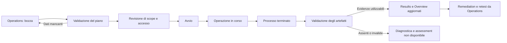

# Claudit — Report di analisi e proposta UI/UX

Data: 9 settembre 2026. Base analizzata: commit `8f5a0f7`, ramo `main`.

**Decisione proposta:** organizzare Claudit intorno a tre attività: **Overview per comprendere rischi e copertura, Operations per preparare ed eseguire controlli, Results per investigare e confrontare le evidenze**. “New operation” si avvia esclusivamente da Operations. Le sessioni diventano il contesto condiviso di lavoro, selezionabile in una barra compatta.

Stato di attuazione: il cockpit descritto nelle fasi A–D è stato implementato il 9 settembre 2026 mantenendo HTML, CSS, JavaScript e servizio Python senza nuove dipendenze. Sono operativi il nuovo flusso Operations, il wizard adattivo, la Overview per scope, Results con dettaglio immediato, la separazione fra esecuzione ed evidenza, il confronto fra assessment compatibili e il polling condiviso. Ogni dominio inserito è ora accettato automaticamente come asset: `Domain.AuthorizedDomains` è deprecato e ignorato. Uno storico persistente consolida sotto un'unica identità normalizzata gli assessment successivi, la copertura, il rischio, i gap e le transizioni dei controlli anche oltre la retention dei report. Le campagne multiscope e le relazioni di attack path indicate nella fase F restano un'estensione del runtime: l'interfaccia non dichiara capacità che i collector non possiedono.

## 1. Analisi eseguita e riscontri misurati

Verificati il servizio attivo su `http://127.0.0.1:8765`, le pagine Overview, Operations e Reports, l'apertura del report e il codice HTML/CSS/JavaScript/Python. L'HTML, `dashboard.js` e `dashboard.py` installati in `/opt/claudit` coincidono, tramite SHA-256, con quelli del checkout. Browser Chromium tramite Playwright; viewport 1440×900, 1366×768 e 390×844. Nessun errore o warning di console osservato durante l'ispezione.

Le misure rappresentano una fotografia del servizio in uso: il numero di operazioni e report può cambiare durante la navigazione. Le coordinate Y sono riferite all'inizio del documento, in pixel CSS; non sono tempi di esecuzione né misure di rischio.

| Misura | Desktop 1440×900 | Laptop 1366×768 | Mobile 390×844 |
|---|---:|---:|---:|
| Altezza pannello sessioni, con sezioni avanzate chiuse | 851 px | 851 px | 1.312 px |
| Inizio risultati nella Overview | Y 1.108 | Y 1.108 | Y 1.788 |
| Titolo New operation | Y 1.720 | Y 1.720 | Y 2.954 |
| Inizio contenuto Operations | Y 1.010 | Y 1.010 | Y 1.528 |
| Altezza documento Overview | 2.681 px | 2.681 px | 5.000 px |
| Altezza documento Operations | 3.478 px | 3.478 px | 4.701 px |
| Altezza documento Reports, prima del dettaglio | 3.158 px | 3.158 px | 5.424 px |

Aprendo un report con 23 righe a 1440×900, il dettaglio inizia a **Y 3.133** e il documento raggiunge **5.619 px**. L'analisi viene aggiunta sotto l'archivio, quindi l'azione “Open analysis” non porta direttamente il risultato nella prima schermata.

Nelle tre viewport la larghezza del documento coincide con quella disponibile: il problema principale osservato è la profondità verticale e la collocazione delle attività. Non si deduce da questo una conformità completa dell'accessibilità.

Evidenze visive locali, escluse da Git perché possono contenere dati degli assessment:

- [Overview desktop](/home/ale/localdev/claudit/output/playwright/ui-review-20260909/overview-1440.png).
- [Reports desktop](/home/ale/localdev/claudit/output/playwright/ui-review-20260909/reports-1440.png).
- [Dettaglio completo del report](/home/ale/localdev/claudit/output/playwright/ui-review-20260909/inspector.png).

### Problemi prioritari

| Priorità | Riscontro | Conseguenza | Intervento |
|---|---|---|---|
| P0 | Sessioni fuori dai pannelli di navigazione, sempre prima del contenuto | Ogni pagina comincia con quasi una schermata di gestione sessioni | Selettore compatto; gestione sessione su richiesta |
| P0 | New operation nella Overview; Operations contiene solo storico | Avvio e monitoraggio separati | Wizard e dettaglio esecuzione dentro Operations |
| P0 | “View log” torna alla Overview | Perdita del contesto operativo | Log nel dettaglio dell'operazione selezionata |
| P0 | Inspector aggiunto dopo l'intero archivio report | Risultato fuori vista anche dopo l'apertura | Vista dedicata con elenco e dettaglio affiancati |
| P0 | Metriche centrate sull'ultimo assessment globale | Il risultato di un altro perimetro può diventare il riferimento visivo | Filtro di scope obbligatoriamente visibile e selezione coerente |
| P1 | Mode e Control level sovrapposti; preflight predefinito | L'utente può aspettarsi un'analisi da un controllo dei prerequisiti | Una scelta del livello e un controllo separato del motore |
| P1 | Entra, Exchange, SharePoint e OneDrive preselezionati | Il check di dominio richiede prima di correggere lo scope | Preset “Check dominio”, Domain soltanto |
| P1 | Severity disponibile nel JSON ma assente dalla tabella di analisi | Un fallimento lieve e uno grave appaiono simili | Colonne distinte per severità ed esito |
| P1 | Filtro di stato senza `not_applicable` | Non si possono isolare i controlli non applicabili | Tutti gli stati supportati, con conteggi |
| P1 | Remediation estesa anche sulle righe pass/info | Rumore e righe molto alte | Sintesi in tabella; istruzioni complete nel dettaglio |
| P1 | Due richieste `/api/state` ogni ciclo di cinque secondi | Lavoro duplicato e possibili snapshot diversi | Un solo caricamento condiviso tra le viste |
| P1 | Impostazioni globali di retention nel form operativo | Una nuova operazione mescola configurazione e amministrazione | Retention nelle impostazioni |
| P1 | Domanda libera e gestione sessioni nello stesso pannello | L'assistenza aumenta lo scrolling | Assistente contestuale laterale, apribile su richiesta |
| P2 | Identificativi tecnici e percorsi occupano lo storico | Scarsa leggibilità degli obiettivi e degli asset | Titolo operazione, target, profilo, esito; percorsi nei dettagli |

Il duplicato delle richieste è osservato anche nel browser: gli ultimi tre cicli hanno coppie distanziate di circa 23–24 ms, a intervalli di cinque secondi. Nel codice `refresh()` carica lo stato e invia un evento che induce `renderOverview()` a ricaricarlo.

### Vincoli dei risultati da correggere prima dei nuovi grafici

- `report_overview()` seleziona correttamente solo operazioni Passive/Active, ma prende la prima dell'indice globale. L'indice usa la data di modifica del file, non una cronologia semantica dell'assessment.
- `/api/state` usa una pagina predefinita di 200 report. I conteggi ricavati da quella lista non rappresentano necessariamente l'intero archivio, anche se la retention configurabile arriva a 10.000.
- La copertura attuale conta tutte le righe diverse da `unknown` ed `error`, includendo `info`, `not_applicable` e controlli formali presenti nel report. Non è una percentuale di sicurezza né la copertura del patrimonio cloud.
- `Summary.High` conta le severità high/critical indipendentemente dallo stato. Non deve alimentare direttamente una card “rischi aperti”.
- In caso di report non leggibile, `salient` può risultare vuoto. Un pannello rischi non deve trasformare quel vuoto in “nessun problema”.
- `resource_uid`, `finding_id`, categoria, timestamp e hash dell'evidenza esistono già. Tuttavia il resource UID predefinito identifica spesso uno scope di servizio: non autorizza a contare singole VM o risorse cloud come se fossero già normalizzate.

## 2. Architettura dell'esperienza

### Navigazione principale

| Area | Domanda a cui risponde | Contenuti |
|---|---|---|
| **Overview** | Dove sono i rischi e quanto posso fidarmi della valutazione? | KPI, matrice dei controlli, rischi prioritari, copertura, variazioni |
| **Operations** | Cosa voglio controllare e cosa sta succedendo? | New operation, wizard, operazioni in corso, storico, log |
| **Results** — evoluzione di Reports | Quale evidenza dimostra il problema e come lo verifico? | Finding, controlli, evidenze, confronto, remediation, esportazioni |

Barra superiore condivisa: **sessione/perimetro · target · intervallo temporale · aggiornamento dati**. Il collegamento “Gestisci sessione” apre dettagli, baseline e note senza inserire un grande pannello prima di ogni pagina. Impostazioni e stato del motore rimangono azioni secondarie della navigazione.

La Overview può contenere “Vai a Operations” negli stati vuoti. Non contiene form di esecuzione. “Ripeti”, “Verifica correzione” e “Esegui sessione”, ovunque richiamati, aprono la stessa bozza in Operations; l'avvio effettivo avviene lì.

### Entità e contesto

**Sessione:** obiettivo di lavoro, scope e baseline versionati, note e operazioni collegate. **Operazione:** un'esecuzione precisa con parametri congelati. **Assessment:** evidenza raccolta da un'operazione Passive/Active. **Risultato di controllo:** una valutazione riferita a scope o risorsa. **Rischio:** interpretazione motivata di uno o più risultati, con collegamenti alle fonti.

Il check occasionale non obbliga a creare una sessione. Alla fine si può salvare lo scope come sessione ripetibile. Per una sessione esistente si riutilizzano i suoi parametri, senza leggere i valori di un form nascosto in un'altra pagina. Il comportamento attuale mantiene fisso lo scope della sessione: conservarlo e rendere esplicito “Crea nuova versione” quando cambia.

## 3. Dal check di dominio all'audit specialistico

Separare **profondità del lavoro** e **modalità di raccolta**. Un audit tecnico può essere molto approfondito usando sole API di lettura; Active non significa automaticamente più completo o più avanzato.

| Livello tecnico | Significato nella UI | Risultato utilizzabile |
|---|---|---|
| Formal | Valida configurazione e perimetro localmente | Pronto/non pronto per procedere; nessun giudizio sulla sicurezza dell'asset |
| Passive | Raccoglie DNS e dati tramite accessi in lettura | Valutazione limitata ai controlli e alle evidenze raccolte |
| Active | Aggiunge sonde esplicite e circoscritte | Evidenza ulteriore degli endpoint dichiarati |

Preflight resta una verifica del motore, separata dai tre livelli. Il termine Passive deve spiegare che possono avvenire connessioni DNS/API: non equivale ad assenza di traffico.

### Profili di utilizzo proposti

| Profilo | Percorso e input principali | Output | Disponibilità |
|---|---|---|---|
| **Check dominio** | Dominio → revisione scope → raccolta Passive | DNS, controlli email, copertura, problemi prioritari | Collector presenti; preset UI da realizzare |
| **Dominio approfondito** | Dominio, selettori DKIM, sottodomini delimitati, baseline DNS, resolver; TLS Active opzionale | Scostamenti DNS, controlli email/TLS, limiti e prossimi passi | Molte capacità già presenti; configurazione guidata incompleta |
| **Cloud posture** | Provider, account/progetto/subscription, regione e accesso in lettura | Controlli identità, logging, esposizione e configurazione disponibili per provider | Collector presenti; flusso UI da consolidare |
| **VPS assessment** | Host dichiarato, contesto SSH, baseline; sonda Active opzionale | SSH, firewall, listener, aggiornamenti e log nei limiti dei collector | Collector presenti; parametri effettivi da allineare alla UI |
| **Audit specialistico** | Scope ripetibile, baseline, famiglie di controllo e qualità delle evidenze | Valutazione tecnica, confronto, motivazione delle priorità, retest | Composizione delle capacità presenti; alcune API/UI da sviluppare |
| **Campagna élite** | Più scope espliciti e revisionati, relazioni fra asset, percorsi di attacco da verificare | Dossier correlato, lacune di telemetria, prove e retest | Estensione futura: orchestrazione e modello delle relazioni non sono oggi completi |

Nel catalogo corrente risultano **92 controlli: 5 Formal, 85 Passive e 2 Active**. La distribuzione include Runtime e Inventory e non equivale a 92 controlli applicabili a ogni audit. Sono catalogati, fra gli altri, 20 controlli Domain, 9 AWS, 7 Azure, 8 GCP e 10 VPS. I due controlli Active riguardano Domain e VPS. Il conteggio descrive il catalogo, non certifica efficacia, accesso o copertura di ogni ambiente.

“Élite” deve significare precisione del perimetro, evidenze verificabili, correlazioni motivate e ripetibilità. Controlli non supportati, exploit validation, analisi completa delle attack path e nuove integrazioni non diventano disponibili aggiungendo un pulsante. Ogni profilo deve mostrare **Disponibile**, **Richiede configurazione** o **Non supportato**, con motivazione.

## 4. Operations e wizard unico

### Schermata Operations

Intestazione compatta con **New operation** come azione primaria. Sotto: filtri per sessione, target, livello e stato; elenco paginato. Selezionando una riga, si apre il dettaglio nella stessa area con schede **Sintesi · Avanzamento · Log · Risultati**.

Ogni riga mostra titolo comprensibile, target, profilo/livello, inizio e durata, stato del processo e disponibilità dell'assessment. ID completo, exit code e directory restano consultabili nel dettaglio e copiabili.

Il servizio limita le esecuzioni contemporanee a due e applica un timeout di 600 secondi. Mostrare questi limiti prima dell'avvio. Una coda, la cancellazione sicura o percentuali per singolo controllo richiedono supporto server: fino ad allora indicare “slot occupati”, tempo trascorso e fase effettivamente nota.

### Wizard adattivo

Il check semplice ha tre schermate: **Obiettivo e dominio → Controlli e accesso → Riepilogo e avvio**. Il percorso avanzato usa cinque passi. Un footer sempre raggiungibile contiene Indietro e Avanti; Avvia appare nell'ultimo passo. La sidebar del wizard riassume target, livello e numero di controlli previsti senza ripetere tutte le spiegazioni.

| Passo avanzato | Scelte | Comportamento intelligente |
|---|---|---|
| 1. Obiettivo | Profilo, sessione nuova/esistente o esecuzione singola | “Check dominio” come percorso rapido, senza servizi Microsoft preselezionati |
| 2. Perimetro | Dominio, host o provider; identità e regione quando pertinenti | Mostrare solo i campi richiesti; normalizzare il dominio e far confermare lo scope finale |
| 3. Controlli | Formal/Passive/Active, famiglie, baseline e opzioni disponibili | Conteggio da catalogo e dipendenze; motivare controlli esclusi o bloccati |
| 4. Accesso e fattibilità | Prerequisiti locali, contesto provider, autorizzazioni di connessione/sonda | Distinguere identità configurata da accesso verificato; contattare provider solo entro la scelta autorizzata |
| 5. Revisione | Scope, parametri effettivi, baseline, limiti, destinazione risultati | Un riepilogo eseguibile; cambiare scope o livello rende da rivedere le autorizzazioni |

La selezione arbitraria dei controlli non è oggi esposta dal contratto di avvio. In prima versione il passo 3 mostra il piano effettivo del preset; checkbox di inclusione/esclusione diventano operative soltanto dopo il supporto end-to-end nel runtime.

Esempio di riepilogo breve:

```text
Check dominio · example.com
Raccolta: Passive, DNS sul resolver configurato
Perimetro: Domain soltanto · baseline: versione selezionata
Controlli: elenco e numero calcolati dal piano effettivo
Limiti: DKIM dipende dai selettori; nessuna prova HTTPS in questo profilo
Risultati: assessment navigabile + esportazioni
                              [Indietro] [Avvia controllo]
```

### Regole del flusso

- Tornare indietro conserva i campi. I valori non pertinenti vengono esclusi dalla richiesta effettiva; la UI lo rende visibile nel riepilogo.
- La verifica formale locale può essere incorporata nella preparazione: il check rapido non deve obbligare a lanciare manualmente tre operazioni consecutive.
- Nessun salto automatico da Passive ad Active. Il suggerimento “Verifica HTTPS” prepara un nuovo piano e indica target e tipo di sonda.
- Un problema in un provider non aggiunge automaticamente altri provider o target. L'utente può ridurre lo scope con revisione esplicita.
- Il doppio click non crea due operazioni; oltre al blocco UI serve una chiave idempotente server per gestire retry e risposta di avvio incerta.
- Un timeout della richiesta di avvio porta a “Verifica stato”, non a un nuovo invio cieco.
- Una sessione archiviata è consultabile; per rieseguirla si crea una nuova sessione/versione secondo il modello esistente.
- Esportazione, archivio e cancellazione della sessione sono nel menu contestuale. Quarantena appare soltanto per una sessione illeggibile.
- I progressi sintetici devono essere eventi reali; nessuna percentuale simulata. `Succeeded` significa processo concluso, non asset sicuro.

### Macchina degli stati proposta



Bozza, validazione, fase e validazione artefatti sono stati UX/server proposti; non tutti sono oggi persistiti. Conservare separati `execution_status`, `assessment_outcome` ed `evidence_status`: può esistere un processo terminato con problemi di sicurezza, oppure un processo fallito con evidenza parziale da leggere come tale.

## 5. Overview orientata a rischi e controlli

La Overview deve rispondere entro la prima schermata a cinque domande: **quale perimetro sto guardando, quali problemi richiedono attenzione, quali controlli li dimostrano, quali evidenze mancano e cosa è cambiato**.

L'ispirazione Grafana riguarda griglia compatta, filtri condivisi, pannelli coerenti e navigazione dal generale al dettaglio. Non richiede installare Grafana. Le sue linee guida raccomandano dashboard focalizzate, collegamenti di approfondimento e aggiornamenti proporzionati ai dati. [Fonte: Grafana, dashboard best practices](https://grafana.com/docs/grafana/latest/visualizations/dashboards/build-dashboards/best-practices/).

### Composizione desktop

```text
┌────────────┬─────────────────────────────────────────────────────────┐
│ Claudit    │ Sessione / scope ▾   Periodo ▾   Osservato…   Aggiorna   │
│ Overview   ├─────────────────────────────────────────────────────────┤
│ Operations │ Aperti H/C │ Da verificare │ Copertura │ Lacune │ Δ     │
│ Results    ├──────────────────────────────┬──────────────────────────┤
│            │ Rischi prioritari            │ Matrice famiglie/stati   │
│            │ max 5; link ai controlli     │ selezione → risultati    │
│            ├──────────────────────────────┼──────────────────────────┤
│            │ Variazioni fra assessment    │ Lacune e prossimo passo  │
│ Impostaz.  │ stesso scope e piano         │ fonte, motivo, azione    │
└────────────┴──────────────────────────────┴──────────────────────────┘
```

Al massimo cinque indicatori nella riga principale. Numero totale di file e storico delle esecuzioni passano alle aree dedicate. Una piccola indicazione di operazione attiva può restare nella barra di contesto, collegata a Operations.

### Metriche e denominatori

| Indicatore | Definizione proposta | Regola di visualizzazione |
|---|---|---|
| Problemi H/C confermati | Risultati `fail` con severità high/critical nello scope selezionato, deduplicati | Zero soltanto se l'insieme di dati è valido; non significa copertura completa |
| Da verificare | `warning`, suddivisi per severità | Separati dai problemi confermati |
| Copertura valutativa | `(pass + fail + warning) / controlli applicabili attesi × 100` | Denominatore dal piano; `unknown`, `error` e mancanti lo riducono |
| Lacune di evidenza | `unknown`, `error` e controlli attesi senza risultato, distinguibili | Numero e motivi; fonte assente non diventa pass |
| Variazione | Nuovi problemi, regressioni e correzioni confermate rispetto a riferimento compatibile | “Non confrontabile” quando cambia il perimetro o manca un riferimento |

Per la nuova copertura, `info`, prerequisiti runtime e controlli Formal non entrano nella popolazione valutativa. `not_applicable` esce dal denominatore solo se motivato e coerente con il piano; una raccolta disabilitata non deve eliminare silenziosamente un controllo richiesto. Per controlli per-risorsa l'unità di conteggio è la coppia controllo/risorsa attesa; per controlli aggregati resta controllo/scope. Non mescolare le due unità nello stesso indicatore.

Esempio puramente illustrativo: 20 controlli applicabili attesi, 10 pass, 3 fail, 2 warning, 3 unknown, 1 error e 1 mancante danno copertura **75%**. La quota pass sui 15 valutati è **66,7%**, se serve mostrarla, con il denominatore esplicito. Nessuno dei due valori è uno score complessivo di sicurezza.

Il campo `summary.coverage` attuale va mantenuto leggibile come metrica legacy. Per report senza piano storico mostrare “copertura sui risultati emessi”, oppure indisponibilità della nuova metrica; non ricostruire retroattivamente denominatori inventati.

### Relazione rischio → controllo → evidenza

Prima versione: raggruppamento deterministico per categoria e target. Esempio di rischio da valutare: **protezione dell'identità email del dominio**, collegato a DMARC, SPF e DKIM. La card espone controlli falliti, warning e limiti: l'assenza di un selettore DKIM fra quelli configurati non dimostra l'assenza di DKIM su ogni piattaforma.

La card “rischio” deve dichiarare regola di aggregazione e fonti. Non sommare tre risultati correlati come tre incidenti indipendenti. Usare inizialmente la severità massima dei problemi confermati del gruppo e una coda separata per incertezza. Impatto aziendale, esposizione e criticità dell'asset entrano nella priorità solo quando dichiarati o dimostrati.

Ogni click su card, cella della matrice o punto temporale apre Results con gli stessi filtri, senza nuovo assessment. Il dettaglio conserva il percorso di ritorno e permette di arrivare al JSON originale.

### Serie temporali e selezione dei dati

- Default: ultimo assessment valido del perimetro/sessione selezionati, con ora osservazione e livello. Per vista multiperimetro, un risultato per scope e timestamp visibili.
- Ogni punto rappresenta un assessment realmente eseguito. Nessuna linea continua che suggerisca monitoraggio costante fra due audit.
- Confrontare scope normalizzato, piano, catalogo e baseline compatibili. Cambiamenti di livello mostrano quali controlli sono comuni e quali aggiunti.
- Un controllo non più presente è “rimosso dal piano/non osservato”, non “corretto”. “Corretto” richiede un nuovo esito positivo dello stesso controllo e scope.
- Un ultimo tentativo fallito resta visibile accanto all'ultima evidenza valida: niente sostituzione silenziosa con un vecchio risultato apparentemente attuale.
- Un report corrotto appare come dato non utilizzabile. Zero, nessun dato, nessun risultato nel filtro e caricamento fallito sono stati diversi.
- Data di osservazione e data di aggiornamento UI sono separate; la modifica del file non deve spostare artificialmente la cronologia.

## 6. Results: investigazione e presentazione

Trasformare l'archivio file in una vista di assessment con titolo, scope, data, livello, esito e qualità delle evidenze. JSON/HTML/CSV/Markdown/OCSF/OSCAL restano esportazioni del risultato selezionato.

### Elenco e dettaglio

Tabella compatta: **severità · esito · controllo/titolo · scope o risorsa · variazione**. Paginazione e ordinamento espliciti. Riga di una o due linee; la descrizione completa compare selezionandola. Non nascondere definitivamente l'ID controllo su mobile: mostrarlo nella scheda del finding.

Il dettaglio contiene quattro schede:

1. **Sintesi:** cosa è stato osservato, impatto motivato e limiti.
2. **Evidenze:** risultato osservato, atteso, timestamp, provenienza, hash e artefatto originale.
3. **Controllo:** ID, famiglia, livello di catalogo, baseline e prerequisiti.
4. **Remediation e retest:** azione pertinente all'esito, criterio di verifica e collegamento al piano in Operations.

Per un pass mostrare il criterio soddisfatto e l'eventuale mantenimento richiesto. Per `unknown/error` la prima azione è recuperare evidenza o accesso; per `not_applicable` mostrare la motivazione. Una raccomandazione generica del catalogo non deve sembrare una correzione urgente di un controllo già soddisfatto.

### Filtri e confronto

Filtri per target, servizio, famiglia, severità, tutti i sette stati, livello, intervallo, variazione e testo. Preset: **Problemi confermati**, **Da verificare**, **Evidenze mancanti**, **Tutti**. Conteggio totale e del sottoinsieme filtrato sempre visibili.

Confronto a due colonne “Riferimento / Attuale”, con differenze testuali delle evidenze quando disponibili. Il comando CLI `compare` esiste già; servono integrazione UI/API e verifiche più esplicite di compatibilità di piano/baseline. Esportare il filtro corrente deve dichiarare scope, intervallo e numero di righe; offrire separatamente il dossier completo.

Stato di lavorazione — aperto, in analisi, rimediato da verificare, accettato con scadenza — distinto dallo stato tecnico del controllo. Registrarlo come annotazione laterale versionata senza riscrivere il report originale. Un click “risolto” non trasforma un fail in pass.

### Dossier tecnico

Il report esportato mantiene una sintesi iniziale, seguita da scope e limitazioni, rischi correlati ai controlli, risultati, evidenze e piano di verifica. Per l'uso specialistico includere versione del catalogo, baseline/relativo hash, parametri effettivi e riferimenti agli artefatti. Le dichiarazioni di conformità o di percorso di attacco richiedono mapping e prove specifiche; non derivano automaticamente dai formati OSCAL/OCSF.

## 7. Interfaccia intelligente e assistenza contestuale

Il sistema attuale risponde alle domande cercando termini nei finding e usando risposte costruite localmente. È una base utile, ma non equivale a un analista conversazionale capace di comprendere qualsiasi domanda.

Per il primo aggiornamento usare regole trasparenti e azioni contestuali: **Spiega questo controllo**, **Perché manca evidenza?**, **Confronta con precedente**, **Prepara retest**. Ogni risposta deve riportare report, controllo, data e limite della conclusione. Nessun servizio LLM è necessario per queste funzioni.

Esempi di suggerimenti:

| Condizione osservata | Suggerimento | Effetto |
|---|---|---|
| Nessun assessment | “Prepara il primo check del dominio” | Apre Operations con Domain/Passive |
| DKIM non trovato nei selettori configurati | “Verifica i selettori del provider email” | Apre baseline e limite dell'evidenza |
| API provider non accessibile | “Verifica il contesto di accesso” | Mostra il prerequisito e i controlli bloccati |
| DNS baseline assente | “Aggiungi configurazione attesa per confrontare” | Apre configurazione della sessione |
| Controllo fallito seguito da pass comparabile | “Correzione verificata dall'assessment …” | Collega i due risultati |
| Nuovo tentativo senza evidenze | “Stai consultando il risultato precedente” | Mostra data e operazione fallita |

I suggerimenti compilano una bozza o aprono un dettaglio; non avviano sonde né applicano cambiamenti. Un futuro LLM può riassumere evidenze citate, ma non sostituire validazione, autorizzazioni o calcolo dei KPI.

## 8. Riduzione dello scrolling e accessibilità

**Obiettivo:** prima schermata utile su desktop, con navigazione prevedibile per i dettagli. Non imporre l'assenza assoluta di scrolling a telefono, zoom elevato o contenuti lunghi: nascondere informazioni necessarie renderebbe l'interfaccia meno controllabile.

Budget iniziale a 1366×768: barra superiore 56 px, contesto/filtri 48 px, KPI 88 px, due righe di pannelli da 220 px, spaziature complessive circa 64 px. Totale 696 px. È un vincolo di progetto da verificare con testi reali, non una misura di una UI già realizzata.

- Shell desktop dimensionata sulla viewport; contenitori flex/grid con `min-height: 0` e `min-width: 0` per consentire il corretto restringimento.
- Overview con sintesi entro una schermata; ogni pannello ha un limite esplicito di elementi e “Mostra tutti”.
- In Operations/Results un'area principale di elenco con scorrimento o paginazione; dettaglio separato. Evitare tre livelli di scrollbar annidate e form enormi dentro modali.
- Wizard con area centrale adattiva e azioni sempre raggiungibili; su schermi bassi può scorrere il contenuto del passo.
- A larghezze ridotte usare schede “Rischi / Controlli / Variazioni” e dettaglio a schermo intero con ritorno all'elenco. Non comprimere tutti i pannelli desktop in miniatura.
- Preferire testo corpo 14–16 px, spaziature coerenti e distinzione visiva tra etichette e valori. Colori e icone accompagnano sempre parole come Fallito, Incerto e Errore.
- Stato di caricamento neutro, errore con retry locale, risultati precedenti marcati come non aggiornati; filtri vuoti con azione di reset.
- Focus da tastiera visibile, ordine coerente, ripristino del focus alla chiusura del dettaglio e annunci di stato sintetici. Il log completo non deve essere riletto continuamente da uno screen reader.
- Non utilizzare `overflow: hidden` sul documento senza garantire che ogni contenuto resti raggiungibile. A zoom elevato adottare il layout ridotto e consentire lo scorrimento verticale.

W3C richiede il reflow del contenuto senza perdita di informazioni o funzionalità alle condizioni previste dal criterio 1.4.10; toolbar e footer fissi vanno verificati anche rispetto al focus non oscurato. Questi requisiti guidano il compromesso fra densità e accessibilità. [Reflow](https://www.w3.org/WAI/WCAG22/Understanding/reflow.html), [Focus Not Obscured](https://www.w3.org/WAI/WCAG22/Understanding/focus-not-obscured-minimum.html).

## 9. Frontend e contratto dati

Mantenere HTML, CSS e JavaScript senza framework aggiuntivi e il servizio Python attuale. La complessità da risolvere è soprattutto nello stato condiviso e nella semantica dei dati.

### Interventi frontend

1. Un solo caricatore dello stato, con selettori per vista; l'evento di aggiornamento trasporta lo snapshot già caricato.
2. Separare stato di navigazione, bozza operazione e dati dell'assessment. Modificare un filtro non altera lo scope di una bozza.
3. URL navigabili per vista/operazione/report/filtri e gestione Back/Forward. Nessun token o credenziale negli URL.
4. Un solo renderer dei finding, riutilizzato per Overview e Results; eliminare la decorazione dei link basata su `MutationObserver` quando si integra l'inspector.
5. Aggiornamento selettivo del DOM: il refresh non sostituisce la riga focalizzata, la selezione o la pagina corrente senza necessità.
6. Polling proposto di cinque secondi quando ci sono operazioni attive; 30–60 secondi quando inattivo, sospeso nelle schede nascoste. Una sola richiesta pendente, backoff su errore e protezione dalle risposte fuori ordine.
7. Caricamento del dettaglio solo su richiesta; esportazioni scaricate al click. Paginazione prima di aggiungere virtualizzazione.
8. Consolidare token di stile per spaziature, superfici, testo e stati. Oggi tre fogli CSS si sovrappongono; `workspace.css` contiene anche due assegnazioni diverse per `#sessionStatus`.

### Interventi server necessari

| Capacità | Riutilizzo | Estensione richiesta |
|---|---|---|
| Elenco e dettaglio operazioni | `/api/operations`, log, metadata | Paginazione, titolo, durata e distinzione processo/evidenza |
| Piano eseguibile | `Workspace.plan`, catalogo e validazione | Piano anche per bozze senza sessione; solo controlli effettivamente previsti |
| Avvio | `/api/operations`, `/api/session/run` | Un unico piano con provenienza e idempotenza |
| Overview | `report_overview`, summary | Filtri scope/periodo, aggregazioni corrette, qualità/freschezza e conteggi completi |
| Report | `/api/reports`, `/api/report` | Metadati di assessment, totali e filtri prima della paginazione |
| Confronto | `lib/drift.sh` | API di confronto validata e regole di comparabilità |
| Workflow remediation | Cronologia sessione | Annotazioni collegate a finding/versione, senza alterare l'evidenza |

Nomi e payload dei nuovi endpoint vanno definiti nell'implementazione. Per il piano servono almeno scope normalizzato, livello effettivo, controlli attesi, baseline/hash, versione catalogo, prerequisiti, limiti e avvertenze concrete. Il server deve ricalcolarlo o verificarne la validità prima dell'esecuzione; un riepilogo client non costituisce il contratto effettivo.

`operationRequest()` invia oggi campi nascosti che `start_operation()` non inoltra alla CLI, fra cui `activeTimeoutMs` e `vpsProbePort`. Prima di esporli nel wizard occorre collegare validazione, richiesta e parametri runtime oppure dichiararli non configurabili. Il principio è semplice: ogni campo mostrato deve avere un effetto verificabile.

Per l'indice partire da cache in memoria invalidata da scrittura/cancellazione e metadati dei report. Il totale deve essere indipendente dalla pagina corrente. Introdurre un database soltanto se misure su archivi realistici dimostrano che letture incrementali e paginazione non bastano.

### Correlazione e compatibilità

Riutilizzare `finding_id` per l'identità del risultato e `resource_uid` con la granularità dichiarata dal collector. Aggiungere identità canoniche di risorse/account dove mancanti prima di costruire grafi dominio → IP → VPS → account cloud. Una risoluzione DNS da sola non dimostra proprietà o appartenenza allo stesso tenant.

Una relazione proposta deve contenere sorgente, destinazione, tipo, evidenza, data e qualità della conferma. Riservare le viste di attack path a relazioni sostenute da dati tecnici; le ipotesi restano esplicitamente ipotesi.

I report v2 continuano ad aprirsi. Le nuove proiezioni non riscrivono i vecchi file. Report senza metadati di operazione vengono classificati usando lo scope validato nel documento quando possibile; altrimenti rimangono non classificati, senza introdurli nei KPI come assessment certi.

## 10. Roadmap proposta e criteri di completamento

| Fase | Consegna | Criterio per considerarla completa |
|---|---|---|
| **A — Flusso essenziale, P0** | Sessione compatta; New operation e log in Operations; Results dedicata | Avvio disponibile solo in Operations; sintesi e azioni visibili a 1366×768; tutti i campi esistenti mappati o motivatamente ritirati |
| **B — Wizard, P0/P1** | Preset dominio, percorso avanzato, revisione del piano, validazioni | Check Domain senza servizi estranei; scope persistente fra passi; parametri mostrati uguali a quelli eseguiti |
| **C — Risultati affidabili, P0/P1** | Filtri per scope, stati completi, copertura definita, report invalidi/vecchi espliciti | Nessun dato mancante diventa zero rischi; conteggi indipendenti dalla pagina; inspector subito visibile |
| **D — Overview, P1** | Griglia KPI, matrice controlli, rischi motivati, variazioni | Ogni pannello porta alle evidenze dello stesso scope; grafici basati esclusivamente su assessment reali |
| **E — Specializzazione, P2** | Confronto, annotazioni, baseline versionate, suggerimenti contestuali | Un problema percorre evidenza → azione → retest comparabile senza perdere contesto |
| **F — Campagne élite, evoluzione** | Orchestrazione multiscope e relazioni fra asset | Capacità realmente eseguibili, identità delle risorse verificata e relazioni con provenienza |

Sequenza suggerita: **A → B → C → D → E**. Il contratto dei risultati di C va concordato prima di finalizzare i grafici di D. F è una successiva estensione del prodotto e richiede valutazione separata del runtime; non è un semplice restyling.

### Verifica funzionale e browser richiesta all'implementazione

- Percorso dominio con scope valido, invalido, connessione non autorizzata, resolver indisponibile e risultato parziale.
- Formal/preflight completati senza apparire come postura verificata; Passive e Active distinguibili nella UI e nei dati.
- Sessione esistente, nessuna sessione, sessione archiviata e nuova versione di scope; baseline e note preservate.
- Due slot occupati, doppio click, risposta di avvio incerta, refresh durante l'esecuzione, timeout e artefatto mancante.
- Archivio vuoto, solo report formali, report corrotto, ultimo tentativo fallito e precedente evidenza valida.
- Dataset con 250 report e assessment più vecchio della prima pagina: conteggi globali corretti e filtri applicati prima della paginazione.
- Tutti gli stati, severità high con pass, warning separato da fail, controlli non applicabili motivati, controlli attesi mancanti.
- Confronto stesso scope e confronto incompatibile; un risultato rimosso non appare come correzione.
- Navigazione completa a 1920×1080, 1440×900, 1366×768, 768×1024 e 390×844; zoom 200%/400%, tastiera e focus senza contenuti irraggiungibili.
- Nessuna richiesta `/api/state` duplicata nello stesso ciclo; filtri, bozza, posizione e focus sopravvivono al refresh.

Obiettivi di progetto da misurare: raggiungere New operation in un click da Operations; check rapido in tre passi; arrivare dalla card rischio all'evidenza in non più di due selezioni; feedback locale alle azioni entro 100 ms salvo operazioni di rete. Il caricamento API va misurato separatamente con hardware e dimensione archivio dichiarati.

Durante l'implementazione eseguire i test di comportamento/API pertinenti, `./tests/run.sh`, `git diff --check` e verifica browser sul servizio installato. Se si distribuisce, reinstallare e riavviare il servizio prima della verifica live. Questo report non attesta il superamento di tali verifiche sulla futura interfaccia.

## 11. Riferimenti nel codice

| Area osservata | Riferimento |
|---|---|
| Sessioni globali, Overview, New operation e storico | [dashboard.html](/home/ale/localdev/claudit/web/dashboard.html:44) |
| Scope, navigazione log, polling e invio dei campi | [dashboard.js](/home/ale/localdev/claudit/web/assets/dashboard.js:338) |
| Inspector, filtri e seconda lettura dello stato | [operator-reports.js](/home/ale/localdev/claudit/web/assets/operator-reports.js:1) |
| Dipendenza delle sessioni dal form di operazione | [workspace.js](/home/ale/localdev/claudit/web/assets/workspace.js:48) |
| Indice, summary, Overview, validazione e runner | [dashboard.py](/home/ale/localdev/claudit/service/dashboard.py:150) |
| Piano di sessione e assistenza basata su evidenze | [workspace.py](/home/ale/localdev/claudit/service/workspace.py:153) |
| Identità finding, scope e copertura legacy | [core.sh](/home/ale/localdev/claudit/lib/core.sh:195) |
| Confronto già disponibile nella CLI | [drift.sh](/home/ale/localdev/claudit/lib/drift.sh:1) |
| Controlli runtime e capacità di baseline | [runtime-control-catalog.json](/home/ale/localdev/claudit/config/runtime-control-catalog.json:1), [baseline-capabilities.json](/home/ale/localdev/claudit/config/baseline-capabilities.json:1) |

Il primo rilascio deve rendere immediati **orientamento, avvio e lettura dell'evidenza**. Il valore tecnico della nuova UI nasce dalla corrispondenza fra ciò che promette, ciò che il runtime esegue e ciò che i risultati dimostrano.
